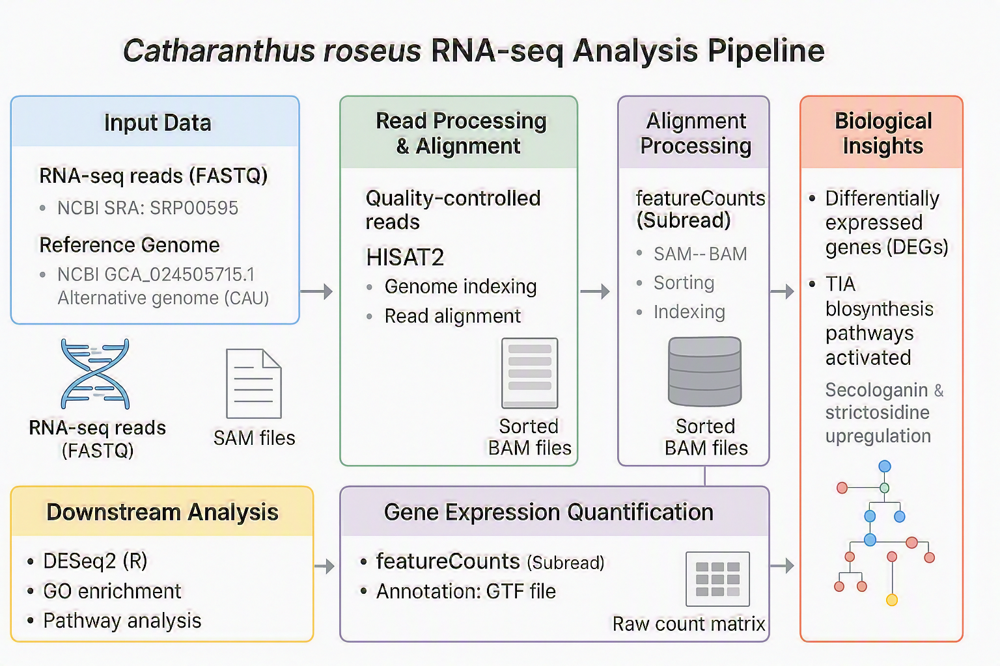

# catharanthus-rnaseq-pipeline
RNA-seq analysis pipeline for Catharanthus roseus across six tissues, highlighting terpenoid indole alkaloid (TIA) biosynthesis. Includes read alignment, quantification, and differential expression (DESeq2), demonstrating hairy roots as an optimal system.
# Catharanthus roseus RNA-seq Pipeline

This repository contains a reproducible RNA-seq analysis pipeline for *Catharanthus roseus*, including read alignment, quantification, and gene annotation.

## 📂 Project Structure
cr-genome-rnaseq-pipeline/
│
├── README.md
├── environment/
│   └── environment.yml
├── data/
│   ├── raw/              # (ignored)
│   ├── reference/
│   └── processed/
├── scripts/
│   ├── 01_download_reference.sh
│   ├── 02_index_genome.sh
│   ├── 03_align_reads.sh
│   ├── 04_postprocess_bam.sh
│   ├── 05_featurecounts.sh
│   └── 06_gene_annotation.py
├── config/
│   └── config.yaml
├── workflow/
│   └── pipeline_overview.md
├── results/
│
└── .gitignore

## 📌 Project Summary
Catharanthus roseus (Madagascar periwinkle) is the sole natural source of vincristine and vinblastine—clinically essential terpenoid indole alkaloid (TIA) anticancer drugs listed as WHO essential medicines. Hairy roots (HR) were induced from leaf explants using Agrobacterium rhizogenes, and bulk RNA-seq was performed across six tissues (HR, IL, ML, St, Rt, and SC). Principal component analysis (PCA) explained 90% of the variance, clearly separating HR and IL (biosynthetically active states) from St and Rt (vascular-associated programs). Differential expression analysis using DESeq2, together with GO and pathway enrichment analyses, revealed significant upregulation of secologanin and strictosidine biosynthetic pathways in HR relative to all other tissues, establishing hairy roots as an optimal system for TIA biosynthesis research.

## 👥 Research Team
Bioinformatics team - Horizon Science Communication LLC
https://www.horizon-sci-comm.us/bioinformatics-services

- Abeer Farag, PhD  
- Hesham Abdullah, PhD  

## 🧬 Research Overview

## ⚙️ RNA-seq Analysis Workflow

### Phase 1: Setup
- HPC job submission (SGE / Slurm)

### Phase 2: Core Pipeline
1. Download reference genome (NCBI)
2. Build HISAT2 index
3. Align RNA-seq reads
4. Convert SAM → sorted BAM (SAMtools)
5. Generate gene counts (featureCounts)
6. Extract gene lengths (gtftools)
7. Extract DEG sequences (Python)

### Phase 3: Extended Analysis
- Re-mapping to alternative genome
- Alignment QC (flagstat)

## ⚙️ RNA-seq Analysis Workflow

  

